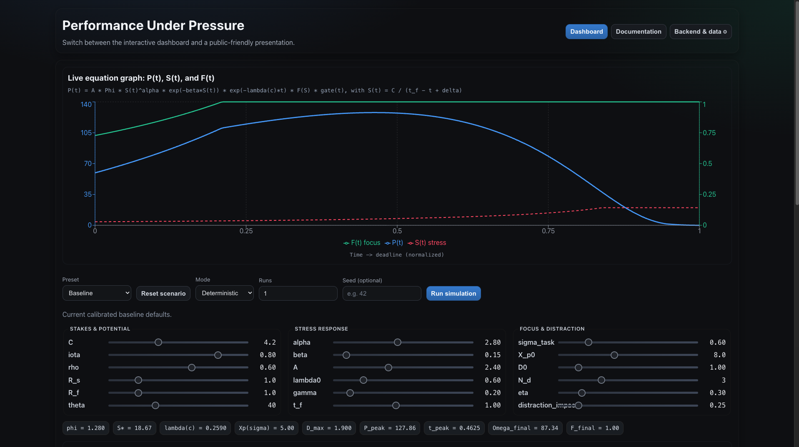
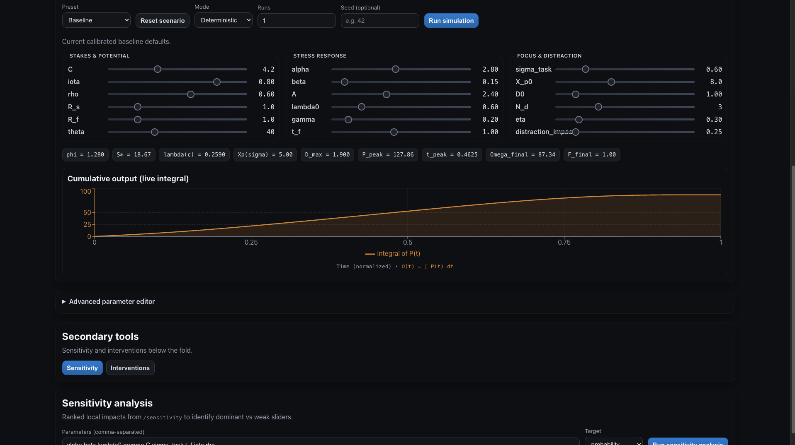

# Performance Optimizer — Unified Project Guide

This repository implements a mathematical model of **performance under pressure** with a Python backend and a React frontend.





## Why this exists

The model formalizes a practical observation:

- Output can stay low early in long horizons.
- Performance can rise sharply near hard deadlines.
- Stakes, focus, fatigue, and perceived consequence reality shape this curve.

The practical objective is intervention design: create conditions that trigger high performance earlier.

## Repository contents

- **Backend (`src/performance_model`)**
  - FastAPI endpoints for simulation, evaluation, calibration, sensitivity, and intervention comparison
  - Pydantic schemas and parameter governance
  - Numerical model implementation with NumPy/SciPy
- **Frontend (`web`)**
  - React + TypeScript + Vite dashboard
  - Interactive graphing, presets, sensitivity tools, and intervention comparison
  - Public presentation mode
- **Tests (`tests`)**
  - Backend API and model tests

## Repository layout

```text
.
├── README.md
├── pyproject.toml
├── requirements.txt
├── src/performance_model/
├── tests/
└── web/
```

## Model overview

The implementation uses a two-layer architecture:

- **Layer 1 (output engine):** models instantaneous output `P(t)` from stress, capability, focus/distraction, fatigue, and noise.
- **Layer 2 (outcome evaluation):** maps accumulated output `Ω` against threshold `θ` and extrinsic factors into success probability `p`.

There is a feedback path where estimated probability influences perceived consequence reality `ψ`, which scales effective stress.

## Public-friendly parameter names

The app uses plain-English labels in the UI while keeping technical API keys stable for compatibility.

Examples:

- `C` -> **Consequence pressure**
- `alpha` -> **Stress activation sensitivity**
- `beta` -> **Stress overload sensitivity**
- `X_p0` -> **Focus threshold baseline**
- `sigma_task` -> **Task stimulation level**
- `theta` -> **Success threshold**

## Key equations

Stress:

`S(t) = (C * ψ) / (t_f - t + δ)`

Potential:

`Φ = ι * (R_s * R_f) * (1 + ρ)`

Fatigue suppression:

`λ(C) = λ0 * exp(-γC)`

Outcome probability:

`p = sigmoid(gain * (((Ω - θ) / |θ|) + X))`

## API endpoints

- `GET /health`
- `GET /parameter-governance`
- `POST /simulate`
- `POST /evaluate`
- `POST /calibrate`
- `POST /sensitivity`
- `POST /compare-interventions`

OpenAPI docs: `http://127.0.0.1:8000/docs`

## Quick start

### 1) Start backend

From repo root:

```bash
python3 -m venv .venv
. .venv/bin/activate
pip install -r requirements.txt
uvicorn performance_model.main:app --app-dir src --host 127.0.0.1 --port 8000
```

### 2) Start frontend

From `web/`:

```bash
npm install
npm run dev
```

Default frontend API URL: `http://127.0.0.1:8000`.

## Development checks

### Backend

```bash
. .venv/bin/activate
pytest -q
```

### Frontend

```bash
cd web
npm run lint
npm run build
```

## Regenerate frontend API types

If backend schemas change:

```bash
# from repo root
. .venv/bin/activate
PYTHONPATH=src python - <<'PY'
import json
from performance_model.main import app
with open('web/src/api/openapi.json', 'w', encoding='utf-8') as f:
    json.dump(app.openapi(), f, indent=2)
PY

# from web/
npm run generate:api
```

## CI

GitHub Actions workflow: `.github/workflows/ci.yml`

Runs:

- Backend tests (`pytest -q`)
- Frontend lint and build (`npm run lint`, `npm run build`)
